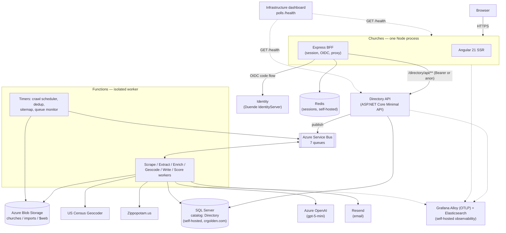
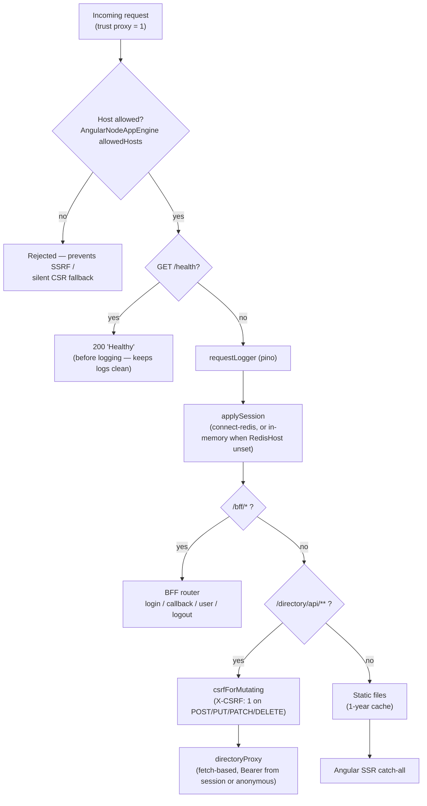
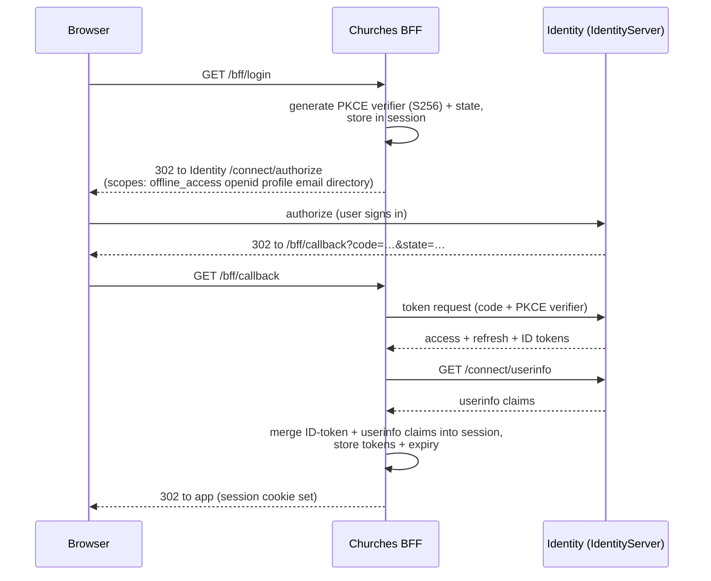
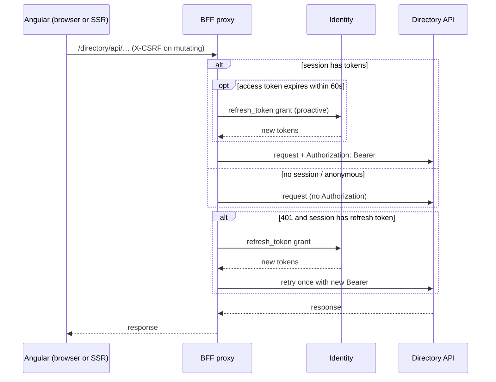
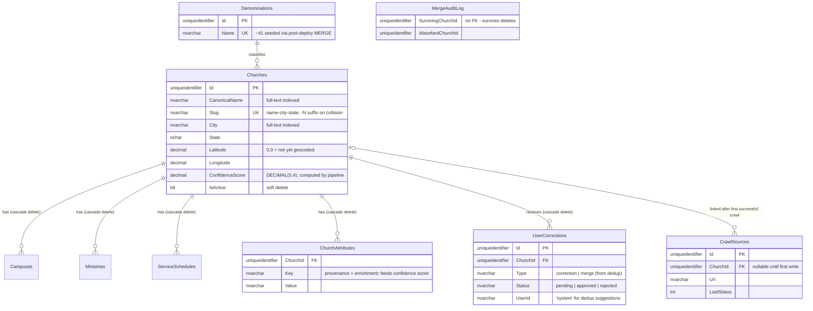
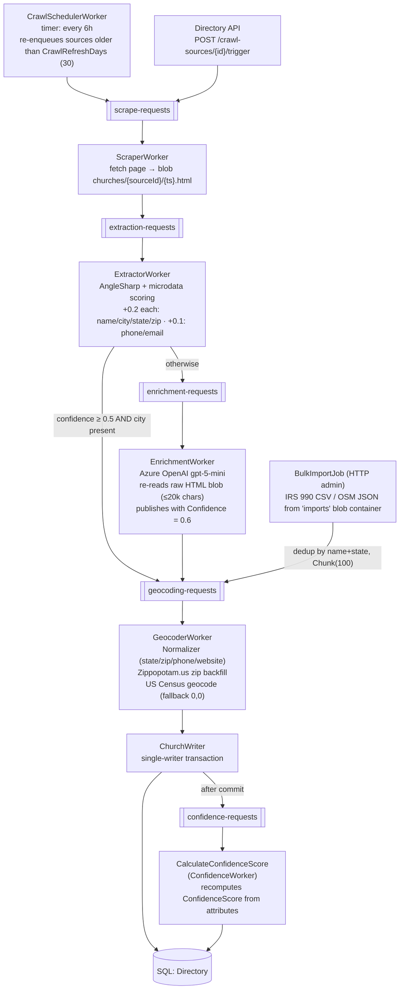
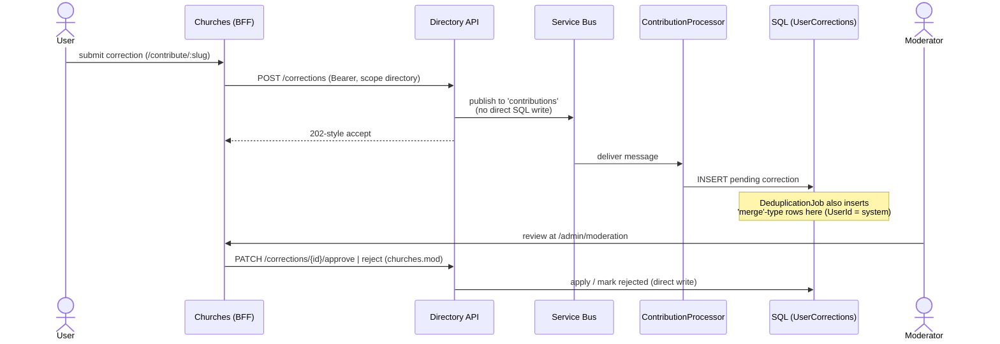
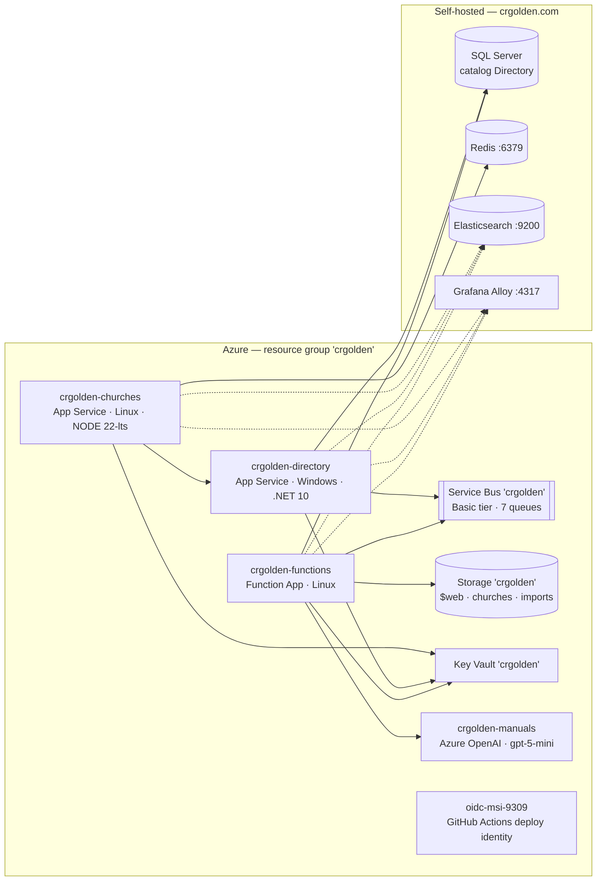

# Church Platform Architecture

This document describes the nationwide U.S. church-discovery platform end-to-end: how a page request travels through the **Churches** app (Angular SSR + Node BFF), how the **Directory** API serves and curates the data, and how the **Functions** pipeline discovers, scrapes, enriches, geocodes, and scores churches in the background. It is the authoritative architecture reference for the platform; the per-repo READMEs keep only operational reference (commands, config keys, deployment steps).

| Repo | Role | Reference docs |
|---|---|---|
| [Churches](https://github.com/crgolden/Churches) (this repo) | Angular 21 SSR app + Node (Express) BFF — the only user-facing surface | [README](README.md), [TESTING](TESTING.md) |
| [Directory](https://github.com/crgolden/Directory) | ASP.NET Core 10 Minimal API + SQL Server — the church data service | [README](https://github.com/crgolden/Directory/blob/main/README.md), [SEEDING](https://github.com/crgolden/Directory/blob/main/SEEDING.md) |
| [Functions](https://github.com/crgolden/Functions) | Azure Functions isolated worker — the data-acquisition pipeline and scheduled jobs | [README](https://github.com/crgolden/Functions/blob/main/README.md) |
| [Identity](https://github.com/crgolden/Identity) | Duende IdentityServer — issues every token the platform validates | [README](https://github.com/crgolden/Identity/blob/main/README.md) |
| [Shared](https://github.com/crgolden/Shared) | Private NuGet package with self-validating domain entities | — |

## System context

The browser only ever talks to the Churches app. The Directory API is the single interactive data service, consumed exclusively through the Churches BFF. All background data acquisition flows through Azure Service Bus queues into the Functions workers, which write to the same SQL database the Directory API reads — but through exactly one gate (`ChurchWriter`, described below).

---

## The Churches app (UI + BFF)

One Node process does both server-side rendering and the backend-for-frontend. There is no .NET server in this repo: `src/server.ts` is an Express app that owns the session, the OIDC dance, and the proxy to the Directory API, then hands anything left over to the Angular SSR engine.

### Request path through the Express stack

Middleware mounts in this exact order (`src/server.ts`):

Two details here are load-bearing:

- **`allowedHosts` is an SSRF guard with an SEO failure mode.** Angular SSR rejects requests whose `Host` header isn't allow-listed — but the rejection is a *silent fallback to client-side rendering*, which defeats server-rendered SEO without any error. The allow-list is sourced per environment via `fileReplacements` (`src/environments/`): production allows `crgolden.com`, `*.crgolden.com`, and `*.azurewebsites.net`; dev and CI allow only `localhost`. Any new production hostname must be added there.
- **The proxy is hand-rolled, not `http-proxy-middleware`.** `src/bff/proxy.ts` uses `fetch` directly because it needs token-aware behavior a generic proxy doesn't have (next section).

### Authentication

The BFF holds all tokens in the server-side session; the browser only ever has the `churches.sid` session cookie. Login is a standard OIDC authorization-code flow with PKCE via `openid-client` v6:

- The session cookie is `sameSite: 'lax'` — `Strict` breaks the OIDC callback (the redirect back from Identity is a cross-site navigation, so a Strict cookie wouldn't be sent and the callback couldn't find the session's PKCE verifier). `secure` in production.
- Sessions live in Redis via `connect-redis` when `RedisHost` is set, otherwise an in-memory store (local dev only — sessions don't survive a restart).
- `/bff/user` returns the session's claims (requires the `X-CSRF` header) and appends a `bff:logout_url` claim carrying the session ID; `/bff/logout` verifies that sid matches the live session before doing RP-initiated logout at Identity.
- Known quirk: `/bff/login` accepts but ignores the `returnUrl` query parameter that `authGuard` appends — after login you land on the app root, not the page that triggered the redirect.

### Proxying to the Directory API

Every data call from Angular goes to `/directory/api/**`, and the BFF forwards it with `fetch`:

This gives **UserOrNone parity** with the Directory API's auth model: authenticated users get their token attached, anonymous visitors get anonymous access to the anonymous endpoints — the same URL space works for both. The proxy buffers request bodies so the retry-after-refresh can replay them, strips hop-by-hop headers and `x-csrf` before forwarding, and enforces the CSRF header only on mutating methods.

### The Angular application

| Route | Rendered | Guard | Purpose |
|---|---|---|---|
| `/` | Server | — | Search landing page |
| `/churches` | Server | — | Results list (grid / list / map views) |
| `/churches/:slug` | Server | — | Church detail (+ inline curation forms for moderators) |
| `/contribute/:slug` | Client | `authGuard` | Submit a correction |
| `/admin/moderation` | Client | `modGuard` | Review corrections, crawl sources, merges |

The split is deliberate: anonymous routes are `RenderMode.Server` because they are the SEO surface; authenticated routes are `RenderMode.Client` because SSR has no session and would render a useless logged-out shell. `AuthService.initialize()` no-ops under `isPlatformServer` for the same reason.

- **Zoneless** change detection (`provideZonelessChangeDetection()`) with hydration + event replay.
- `AuthService` exposes signals; `hasModerationScope` is true when the claim `churches.mod === 'true'`. `authGuard` hard-navigates to `/bff/login` (a full page load — the login flow is server-side); `modGuard` returns a UrlTree to `/`.
- Two HTTP interceptors: `appInterceptor` adds `X-CSRF: 1`, a per-request `X-Request-ID`, and `withCredentials`; `ssrAbsoluteUrlInterceptor` rewrites relative URLs to absolute during SSR (Node's `fetch` can't resolve relative URLs).
- Maps are Leaflet, loaded via dynamic import and guarded with `isPlatformBrowser` — Leaflet touches `window` and would crash SSR.

### SEO

`SeoService` (`src/shared/seo.service.ts`) sets title, meta description, canonical, Open Graph, and Twitter tags per page; detail pages additionally emit a JSON-LD `@graph` containing schema.org `Church` and `BreadcrumbList`. All of it renders server-side on the public routes. The sitemap is *not* generated by this app — the Functions `SitemapGenerator` timer writes it to blob static hosting nightly (see the pipeline section), and `public/robots.txt` points crawlers at it.

> **Hostname note:** `robots.txt` points at the sitemap's real location — the storage static-web endpoint (`https://crgolden.z13.web.core.windows.net/sitemap.xml`, i.e. the `$web` container `SitemapGenerator` writes to). The URLs *inside* the sitemap use `ChurchesBaseUrl` (`https://crgolden-churches.azurewebsites.net`) — no custom domain is bound to the Churches App Service yet. When one lands (the prod `allowedHosts` entries for `crgolden.com` already anticipate it), align `ChurchesBaseUrl`, `robots.txt`, and canonical URLs to it.

---

## The Directory API

The Directory API is the platform's only interactive data service: an ASP.NET Core 10 Minimal API over SQL Server using BCL ADO.NET (no EF Core, no Dapper), organized as vertical feature slices — each slice is a folder with `*Endpoints.cs` + a scoped `*Service.cs`.

### Slices and authorization

JWT Bearer validation against Identity with `ValidateAudience = false` and `MapInboundClaims = false` (claims keep their OIDC names). Two policies:

- **`Directory`** — requires claim `scope = directory` (any authenticated user of the platform).
- **`ChurchesMod`** — requires claim `churches.mod = true` (moderators).

| Slice | Endpoints | Auth |
|---|---|---|
| `Search/` | `GET /search` (text, geo-radius, state, denomination, worship style, accessibility, schedule filters) | Anonymous |
| `Church/` | `GET /churches`, `GET /churches/{slug}` | Anonymous |
| | `POST /churches`, `PUT`/`PATCH`/`DELETE /churches/{id}` | `ChurchesMod` |
| `Denomination/` | `GET /denominations` | Anonymous |
| `Schedules/` `Ministries/` `Campuses/` | `POST /churches/{id}/…`, `PUT`/`DELETE /…/{id}` (child curation) | `ChurchesMod` |
| `Moderation/` | `GET /corrections`, `PATCH …/approve`, `PATCH …/reject`, `POST /churches/{id}/merge/{id}` | `ChurchesMod` |
| | `POST /corrections` | `Directory` scope |
| `Crawling/` | `GET`/`POST /crawl-sources`, `DELETE`, `POST …/trigger` | `ChurchesMod` |
| `Admin/` | `POST /admin/import` (CSV), `GET /admin/export` (CSV stream) | `ChurchesMod` |
| `User/` | `GET /me` | Anonymous |

> **Known quirk:** `GET /me` computes its `HasModerationScope` field by looking for a `scope = churches.mod` claim, while the `ChurchesMod` policy that actually gates moderation endpoints checks the claim `churches.mod = true`. These are different claim shapes; the two can disagree depending on how the token is minted. Documented here rather than silently papered over.

### Search internals

`GET /search` builds dynamic SQL from whichever filters are present:

- Free text → full-text `CONTAINSTABLE` over `(CanonicalName, City)`, AND-ing prefix terms; the rank drives the default relevance sort.
- Location → `dbo.fn_HaversineDistance` (miles, Earth radius 3958.8) filters within `radiusMiles` (default 25) and powers the distance sort.
- Schedule filters (`dayOfWeek`, `startTimeBefore/After`) → an `EXISTS` subquery against `ServiceSchedules`.
- Paging → `COUNT(*) OVER()` window count in the same query; `pageSize` clamped to 1–50.

### Data model

Schema is owned by `Directory.Data` (a `Microsoft.Build.Sql` SQL project, deployed as a dacpac — always before the app in CI). No views or stored procedures; one scalar function (`fn_HaversineDistance`).

### What Directory writes vs. what it delegates

The API writes churches and their children directly only for **moderator-initiated** operations: church CRUD, child curation, correction approve/reject, and merge. Merge is a single ADO.NET transaction that repoints all child FKs (CrawlSources, ChurchAttributes, ServiceSchedules, Ministries, Campuses, UserCorrections) to the surviving church, soft-deletes the absorbed one, and inserts a `MergeAuditLog` row.

Everything else it **delegates to the pipeline** by publishing Service Bus messages (its managed identity has only the *Sender* role — it cannot consume):

| Endpoint | Queue | Consumer |
|---|---|---|
| `POST /admin/import` (CSV) | `geocoding-requests` (one message per row) | `GeocoderWorker` |
| `POST /crawl-sources/{id}/trigger` | `scrape-requests` | `ScraperWorker` |
| `POST /corrections` | `contributions` | `ContributionProcessor` |

Note the corrections asymmetry: submitting a correction does **not** write to SQL — the message goes to the `contributions` queue and the Functions `ContributionProcessor` inserts the pending row. Only the approve/reject moderation step is a direct API write.

---

## The Functions data pipeline

All church data acquisition is an Azure Functions isolated worker driven by Service Bus queues. Seven queues exist (exactly these — also the set `QueueDepthMonitorJob` watches): `email`, `scrape-requests`, `extraction-requests`, `enrichment-requests`, `geocoding-requests`, `confidence-requests`, `contributions`.

### The queue cascade

The extractor branch is the cost gate: pages the deterministic extractor can read with confidence ≥ 0.5 (`Tier2Threshold`) *and* a city skip the LLM entirely; only ambiguous pages pay for an OpenAI call. The enrichment worker deliberately re-downloads the original HTML blob and prompts against the raw page — not the extractor's already-incomplete partial fields.

### ChurchWriter — the single-writer invariant

Every church row written by the pipeline goes through `ChurchWriter.UpsertAsync`, whose only caller is `GeocoderWorker`. One transaction covers:

1. Look up `CrawlSources.ChurchId` to decide insert vs. update.
2. Duplicate guard on new inserts (name + city + state + lat + lng already present → link instead of insert).
3. Validate through `Shared.Domain.ChurchBuilder` — an invalid church cannot reach SQL; a bad value throws a specific `ArgumentException` here instead of a constraint violation deep in the write.
4. Upsert `Churches` (slug `name-city-state`, `-N` suffix on collision; denomination resolved by name), link the `CrawlSource`, delete-then-insert all children (`ChurchAttributes`, `ServiceSchedules`, `Ministries`, `Campuses`), and register the church's own website as a crawl source on first insert.
5. After commit: publish to `confidence-requests` so `CalculateConfidenceScore` recomputes the score.

This is why the Directory API never has to defend against concurrent pipeline writes to the same aggregate: there is exactly one write path and it is transactional.

### Function inventory

| Function | Trigger | What it does |
|---|---|---|
| `ScraperWorker` | queue `scrape-requests` | Fetch page → blob `churches/`, enqueue extraction |
| `ExtractorWorker` | queue `extraction-requests` | AngleSharp extraction + confidence scoring, branch to geocode or enrich |
| `EnrichmentWorker` | queue `enrichment-requests` | LLM extraction from raw HTML (gpt-5-mini) |
| `GeocoderWorker` | queue `geocoding-requests` | Normalize, backfill zip, geocode, call `ChurchWriter` |
| `CalculateConfidenceScore` | queue `confidence-requests` | Recompute `ConfidenceScore` from attributes (`ConfidenceScoreCalculator`, lives in this repo) |
| `ContributionProcessor` | queue `contributions` | Insert pending `UserCorrections` row (does not apply the correction) |
| `Email` | queue `email` | Deliver via Resend (used by Identity + Infrastructure alerts) |
| `CrawlSchedulerWorker` | timer `0 0 */6 * * *` | Enqueue recrawls for sources older than `CrawlRefreshDays` (30), batches of 100 |
| `DeduplicationJob` | timer `0 0 4 * * *` | 0.1-mile geo-grid + Jaro-Winkler ≥ 0.85 name similarity → writes `merge`-type `UserCorrections` rows (UserId `system`) for moderator review — it never auto-merges |
| `SitemapGenerator` | timer `0 0 3 * * *` | Active church slugs → `$web/sitemap.xml` (URLs based on `ChurchesBaseUrl`) |
| `QueueDepthMonitorJob` | timer `0 */15 * * * *` | Active + dead-letter message-count gauges for all 7 queues (needs Service Bus Data Owner) |
| `BulkImportJob` | HTTP `POST /api/bulk-import?source=irs\|osm&blobPath=…` (admin key) | Seed from IRS 990 CSV / OSM JSON in `imports` container |
| `ReGeocodeJob` | HTTP `POST /api/re-geocode?max=N` (admin key) | Re-geocode rows stranded at `(0,0)` (excluding PO Boxes) |

### Corrections lifecycle

### Failure handling

The pipeline distinguishes *expected* failures (dead websites, unparseable addresses) from *unexpected* ones, because retrying a dead site is pure alert noise:

- **Malformed/null payloads** are dead-lettered with `deadLetterReason: "malformed-payload"` in every worker — never silently completed.
- **ScraperWorker**: expected fetch failures (`HttpRequestException`, timeouts) mark the source failed (`LastStatus = 2`) and *complete* the message — the next scheduler pass retries naturally. Unexpected exceptions abandon + rethrow.
- **EnrichmentWorker**: OpenAI `ClientResultException` is quietly abandoned for the first few deliveries, then degrades to the extractor's partial data and continues to geocoding rather than dead-lettering indefinitely.
- **GeocoderWorker**: unresolvable state/zip completes the message with a trace event; geocode misses fall back to `(0,0)` — a deliberate "not yet geocoded" marker that `ReGeocodeJob` sweeps later, and the one coordinate `Shared.Domain` validation intentionally allows.
- **Handled failures** are recorded as Tempo trace events (`Telemetry.Tracing.RecordHandledFailure`), not `ILogger` noise. **Unhandled** ones pass through `ExceptionHandlingMiddleware`, which records telemetry and always rethrows (so the Functions runtime's retry/DLQ semantics still apply).

---

## Shared domain layer

`Shared.Domain` (from the private `Shared` NuGet package) provides self-validating entities — `Church`, `Campus`, `Ministry`, `ServiceSchedule`, `ChurchAttribute` — with private constructors and static factories that enforce every NOT NULL/range invariant at construction, mirroring the SQL schema exactly. The one intentional exception: `(0,0)` coordinates are valid, as the pipeline's not-yet-geocoded marker.

**Current adoption is validation-gate-only, stated honestly:** Directory's `ChurchService`/`ScheduleService`/`MinistryService`/`CampusService` and Functions' `ChurchWriter` build a `Shared.Domain` entity to *validate* input (`EnsureValid`-style build-and-discard) before writing, but the wire models and persisted shapes are still local DTOs. Migrating those to the shared entities is a known follow-up, not a done thing.

---

## Cross-cutting

### Identity and tokens

Identity (Duende IdentityServer) issues every token. The Churches BFF is a confidential client (`ChurchesClientId`/`ChurchesClientSecret` fetched from Key Vault at startup) doing code + PKCE with `offline_access`; the Directory API is a pure resource server validating Bearer JWTs. The browser never holds a token — only the session cookie. Moderation rights ride on the `churches.mod` claim minted by Identity.

### Telemetry

All three services export OTLP traces and metrics to a self-hosted Grafana Alloy (gated on `AlloyEndpoint`; `/health` excluded from tracing), and structured logs to self-hosted Elasticsearch — pino (`pino-elasticsearch` multistream, index `logs-dotnet-churches`) for the Node app, Serilog data streams for the .NET services. The Churches OTLP SDK loads as a `node --import ./instrumentation.mjs` sidecar before the app. Fleet-wide telemetry conventions live in the workspace-level TELEMETRY.md (not part of any single repo).

### Azure hosting (live-verified 2026-07-10)

Everything sits in one resource group (`crgolden`, East US). Data stores and observability are deliberately **not** Azure — SQL Server, Redis, Elasticsearch, and Grafana Alloy are self-hosted at `crgolden.com`.

| App | Plan/OS | Runtime identity | Notes |
|---|---|---|---|
| `crgolden-churches` | Linux, `NODE\|22-lts` | System-assigned MI | Startup: `node --import ./instrumentation.mjs dist/churches.client/server/server.mjs`. Only hostname is `crgolden-churches.azurewebsites.net` — no custom domain yet (the `crgolden.com` entries in prod `allowedHosts` are forward-looking) |
| `crgolden-directory` | **Windows**, .NET v10.0 | System-assigned MI | Data protection keys in blob (`identity/keys.xml`) wrapped by a Key Vault key |
| `crgolden-functions` | Linux Function App | System-assigned MI | Fully identity-based bindings (`ServiceBusConnection__fullyQualifiedNamespace` + `__credential`, `AzureWebJobsStorage__credential`) — no connection strings anywhere |

**RBAC per managed identity** (least-privilege, verified per principal):

| Identity | Roles |
|---|---|
| churches | Key Vault Secrets User + Crypto User; Storage Blob Data Contributor |
| directory | Key Vault Secrets User + Crypto User; Storage Blob Data Contributor; **Service Bus Data Sender** (publish-only — it can enqueue but never consume) |
| functions | Key Vault Secrets User; Storage Blob Data Contributor; **Service Bus Data Sender + Receiver + Data Owner** (Owner is required by `QueueDepthMonitorJob` — reading runtime queue properties needs more than Receiver); **Cognitive Services OpenAI User** on `crgolden-manuals` (the OpenAI account is shared with the Manuals app) |
| `oidc-msi-9309` | GitHub Actions federated-credential deploy identity — deployment only, not runtime |

Key production settings (verified): Churches — `OidcAuthority=https://crgolden-identity.azurewebsites.net`, `DirectoryApiAddress=https://crgolden-directory.azurewebsites.net`, `RedisHost=crgolden.com` / `RedisPort=6379`; only `ChurchesClientId`/`ChurchesClientSecret` come from Key Vault, the rest are App Service settings. Directory — `SqlConnectionStringBuilder__DataSource=crgolden.com`, `ServiceBusNamespace=crgolden.servicebus.windows.net`. Functions — `ChurchesBaseUrl=https://crgolden-churches.azurewebsites.net`, `CensusGeocoderUrl=https://geocoding.geo.census.gov/geocoder/locations/address`.

### Deployment pipelines

Each repo deploys independently via GitHub Actions with Azure OIDC federated credentials:

- **Churches** → Linux App Service `crgolden-churches`: `npm ci` → lint → CI build → Vitest → Playwright E2E → SonarCloud → production build → deploy → post-deploy smoke tests.
- **Directory** → Windows App Service `crgolden-directory`: build (compiles the `Directory.Data` dacpac) → unit tests + coverage → SonarCloud → **dacpac deployed via SqlPackage before the app** — the schema is always ahead of or equal to the code.
- **Functions** → Function App `crgolden-functions`: build + deploy (no test job).

Testing strategy per repo: [Churches/TESTING.md](TESTING.md), [Directory/TESTING.md](https://github.com/crgolden/Directory/blob/main/TESTING.md), [Functions/TESTING.md](https://github.com/crgolden/Functions/blob/main/TESTING.md).
